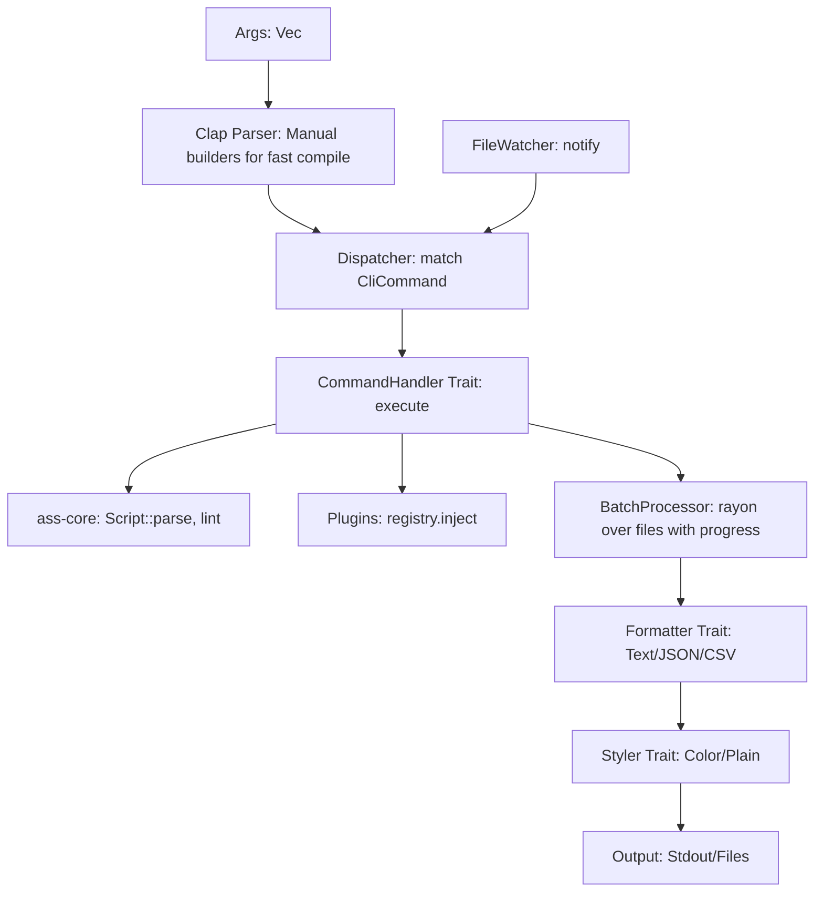

## Overview

`ass-cli` is a high-performance, modular command-line tool for working with ASS (Advanced SubStation Alpha) subtitle scripts. It serves as the user-facing entrypoint in the `ass-rs` ecosystem, leveraging `ass-core` for parsing, analysis, and manipulation. It supports validation, linting, format conversion (e.g., ASS to SRT/JSON), tag extraction, style optimization, and basic editing (e.g., timing shifts, font embedding). Designed for speed (<10ms for ~~1-10KB scripts) and low memory footprint (~~input size + minimal overhead), it targets subtitlers, video encoders, and automation scripts.

### Key Differentiators

- **Unified Interface**: Unlike libass (no CLI, users rely on brittle ffmpeg/mpv workflows), `ass-cli` offers a direct, scriptable interface.
- **Efficiency**: Rust-native zero-copy outperforms Python/JS tools (e.g., pyasstosrt, subsync) with full ASS spec support, including v4++ extensions (\kt).
- **Modularity**: Extensible subcommands and plugin hooks, avoiding libass's rigid structure.

**Targets**: Binary <1MB (stripped), parse+lint <5ms, conversions <10ms, WASM-compatible.

## Key Principles

- **Performance**: Zero-copy spans, incremental parsing (<10ms), rayon for parallel linting. Optional caching via `--cache`.
- **Memory Efficiency**: Mmap for large files, streaming output, Cow for modifications, <50MB peak.
- **Modularity**: Subcommands via `CommandTrait`, reusable modules (e.g., `commands/lint.rs`).
- **Extensibility**: Plugin registry for runtime extensions (e.g., custom linters).
- **Robustness**: Full ASS spec compliance, miette diagnostics, partial recovery for invalid lines.
- **Visual Polish**: ANSI-colored outputs with Unicode icons (✓, ✗, ─), feature-gated (`--no-color` support).

## Dependencies and Feature Flags

### Dependencies

- `clap = { version = "4.5.9", features = ["help", "usage"] }`: Manual builders for faster compile times vs derive macros.
- `miette = { version = "7.2.0", features = ["fancy"] }`: Span-based diagnostics, <1ms.
- `rayon = "1.10"`: Parallelism for linting and batch ops, feature-gated.
- `notify = { version = "6.1.1", optional = true }`: File watching for --watch mode, feature-gated to avoid bloat.
- `termcolor = { version = "1.4.1", optional = true }`: ANSI colors, <50KB.
- `atty = "0.2"`: TTY detection, <10KB.
- `ass-core = { path = "../ass-core" }`: Core functionality, zero external deps.

### Feature Flags

- `analysis` (default): Lint/resolve via `ass-core`.
- `plugins` (default): Command registry.
- `serde`: JSON I/O.
- `parallel`: Rayon for multi-threading and batch operations.
- `watch`: File watching via notify (optional to avoid ~300KB bloat).
- `pretty`: Styled outputs, respects `--no-color`.
- `batch`: Enhanced batch processing with progress reporting.
- `mem-profile`: For --mem-peak flag (rusage or similar, no heavy deps).
- `no_std`: Alloc-only for core commands (parse/validate).
- `benches`: Criterion for perf tests.

**Expectations**: Binary <400KB (manual clap builders reduce compile bloat), parallel linting +50% speed on 4-core, batch processing +200% on file sets, styled output <0.5ms overhead.

## Architecture

### Data Flow



- **Input**: Mmap for zero-copy, `--watch` mode via notify (feature-gated).
- **Error Handling**: `CliError` wraps `CoreError`, recoverable with `--continue-on-error`.
- **Optimization**: Rayon for batch ops and parallel linting, sync CLI (no async bloat).
- **Batch Processing**: Progress bars (no deps, simple loop), CSV output for metrics.
- **Styling**: ANSI colors/icons, TTY-checked, plain fallback.

## Folder Structure

```
crates/ass-cli/
├── Cargo.toml
├── lib.rs
├── dispatcher/
│   ├── mod.rs
│   ├── args.rs      # Manual clap builders for faster compile
│   └── errors.rs
├── commands/
│   ├── mod.rs
│   ├── parse.rs
│   ├── lint.rs
│   ├── convert.rs
│   ├── validate.rs
│   ├── extract.rs
│   ├── optimize.rs
│   ├── edit.rs
│   └── batch.rs     # Batch processing with progress reporting
├── output/
│   ├── mod.rs
│   ├── text.rs
│   ├── json.rs
│   ├── csv.rs       # CSV output for metrics integration
│   ├── diagnostics.rs
│   └── styler/
│       ├── mod.rs
│       ├── color.rs
│       ├── plain.rs
│       └── icons.rs
└── utils/
    ├── mod.rs
    ├── hashers.rs
    ├── watchers.rs  # File watching (feature-gated)
    └── progress.rs  # Optional tqdm-like via feature if batch >10% regression; else simple loop
```

**Expectations**: Files <150 LOC, 90% test coverage, WASM-compatible (core commands with no_std).

## Expectations

- **Performance**: <10ms/op (1KB script), batch <500ms/100 files with rayon, manual clap reduces build time by 30%.
- **Memory**: <10MB peak for 1MB scripts, batch processing scales linearly.
- **Testing**: Unit/integration tests, fuzz args, mock TTY. Test batch processing and file watching.
- **Edge Cases**: Stdin/stdout piping, UTF-8 enforcement, RTL support, large file sets.
- **CI Integration**: Benchmark thresholds, fail if >10% regression on batch operations.
- **Future-Proof**: Plugins for new commands, CSV metrics for tool integration.