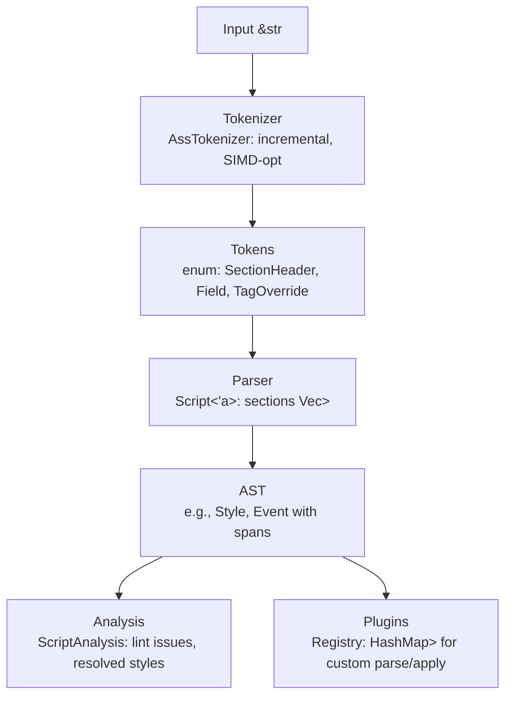

## Overview

`ass-core` is the foundational crate in the `ass-rs` modular library ecosystem, providing a high-performance, memory-efficient implementation of the ASS (Advanced SubStation Alpha) subtitle format parser, analyzer, and manipulator. It adheres to official specs (e.g., [TCax ASS specs](http://www.tcax.org/docs/ass-specs.htm), [Aegisub tag docs](https://aegisub.org/docs/latest/ass_tags/)) and libass's extensions ([libass ASS guide](https://github.com/libass/libass/wiki/ASS-File-Format-Guide)), while surpassing our competitor libass in modularity (trait-based plugins vs. monolithic C code), reusability (standalone modules like tokenizer), and efficiency (zero-copy spans vs. strdup copies). Critically, it avoids libass's pitfalls like global state, color mangling bugs, and late tag support (e.g., `\kt` added in 2022), focusing on Rust idioms for thread-safety (immutable `Script` post-parse) and extensibility.

### Core Functionalities

- **Parsing**: Tokenize and build AST from ASS scripts (v4, v4+, SSA compat).
- **Analysis**: Linting, style resolution, event/tag computation.
- **Plugins**: Runtime-extensible sections/tags (e.g., custom `\my_tag`).
- **Prep for Rendering**: Minimal tag computation (e.g., resolve `\pos` coords), but no full rasterization (deferred to `ass-renderer`).

### Targets

- Parse <5ms for typical scripts (~1KB-10KB).
- <2ms for incremental updates.
- Memory footprint ~input size + AST overhead.

## Key Principles

- **Performance Priority**: Zero-copy parsing (spans on `&'a str`), incremental updates (partial re-parse via ranges), SIMD optimizations (feature-gated for hot paths like delimiter scanning in tokenizer or hex parsing in colors).
- **Memory Efficiency**: Lifetime generics (`'a`) for borrowed data, optional arenas (`bumpalo` for AST construction), lazy decoding (e.g., embedded fonts UU-encoded spans decoded on-demand).
- **Modularity and Reusability**: No flat `src/` folder—subdirs with `mod.rs` for submodules. Each tag/section in its own file for isolation (e.g., testable independently). Expose publics like `pub use tokenizer::AssTokenizer;`.
- **Extensibility**: Traits (`TagHandler`, `SectionHandler`) with a registry (`HashMap`-based) for runtime plugins. Supports ASS extensions (v4++, `\kt`, etc.) without core changes.
- **Criticisms Addressed**: Unlike libass's tight coupling (parsing + shaping + render in one lib), keep pure (no rendering beyond prep). Handle common bugs proactively (e.g., lint negative font sizes, invalid matrices).
- **Thread-Safety**: `Script` is `Send+Sync` via immutable design (`Arc` internals if needed for shared analysis).
- **Compliance**: Full spec support (e.g., bidirectional `Encoding: -1`, XOR for overlapping drawings), partial recovery (warnings on invalid tags), version variants (enum `ScriptVersion`: `SsaV4`, `AssV4`, `AssV4Plus`).

## Dependencies and Feature Flags

### External Dependencies

Minimal, pinned for consistency:

- `thiserror = "1.0.63"`: For custom error enums (e.g., `ParseError`). Avoid `anyhow` in core to reduce bloat (~50KB saved).
- `ahash = "0.8.11"`: Fast, deterministic hashing for HashMap in registry (WASM-friendly). DoS fixes in 0.8.11+.
- No others in core; avoid `serde` unless featured.

### Feature Flags

In `Cargo.toml`, default to minimal set:

- `"analysis"` (default): Enables linting and deep analysis (e.g., `ScriptAnalysis` struct). Disable for parse-only use.
- `"plugins"` (default): Includes registry and trait impls for extensibility.
- `"unicode-wrap"`: Unicode linebreak support for libass 0.17.4 Unicode wrapping (dep: libunibreak if enabled).
- `"serde"`: Adds `Serialize`/`Deserialize` derives on AST (e.g., for JSON export).
- `"simd"`: Enables `wide` crate for SIMD optimizations (e.g., `scan_delimiters_simd` in `tokenizer/mod.rs`). Fallback to scalar code.
- `"arena"`: Uses `bumpalo` for allocation pooling during parse (drop after for zero overhead).
- `"no_std"` (aggressive): Disables `std`, requires `alloc` (use `hashbrown` for `HashMap`, `arrayvec` for fixed `Vec`s). Analysis remains enabled via no_std-compatible crates. Defaults to `std` for simplicity; `no_std` for embedded/WASM efficiency (e.g., ~100KB binary savings, no `std` overhead).
- `"stream"`: Enables `parse_stream` for chunked inputs (network streams, large files).
- `"simd-full"`: Extends SIMD to UUencode decoding and hex parsing (20-40% faster on large embedded fonts).
- `"benches"`: Criterion integration for benchmarks (e.g., parse large karaoke scripts).

### Expectations

- Features keep crate lean (~40KB binary without extras after anyhow removal).
- Benchmark each (e.g., `simd`: 20-30% faster parse, `simd-full`: up to 40% on UUencode).
- CI thresholds: <10% regression tolerance, fail if parse >5ms/1KB script.
- For WASM: `no_std` recommended for <100KB savings and better heap control.

## Architecture

### High-Level Design

Input string → Tokenizer (low-level spans) → Parser (AST build) → Analysis (lint/compute) → Plugins (extend/override).

### Text-Based Diagram



### Data Flow

- Zero-copy (`&'a str` spans in AST).
- Incremental: `parse_partial(range: Range<usize>) -> Delta<Script>`.
- Error Handling: Unified `CoreError` enum (variants: `Parse`, `Analysis`); partial recovery (`Vec<Issue>` on invalid lines/tags).
- Lifetime Management: Generic `'a` on `Script`/`Section` for borrowed efficiency; own data via `Cow` if needed.
- Optimization Hooks: SIMD in tokenizer for bulk scans (e.g., commas in fields, braces in tags). Arenas for temp allocs in drawing parsing (`\p` beziers).

## Folder Structure and Modules

Crate root: `lib.rs` re-exports (e.g., `pub mod parser; pub use parser::Script;`).

```plaintext
crates/ass-core/
├── Cargo.toml  # Dependencies, features as above
├── lib.rs      # Re-exports and crate-level docs
├── parser/     # AST building and parsing logic
│   ├── mod.rs  # Script<'a> struct, impl parse(&'a str) -> Result<Self>, parse_stream for chunked
│   ├── ast.rs  # Core nodes: Script<'a> { sections: Vec<Section<'a>> }, Section<'a> enum (Info, Styles, Events, ...)
│   ├── streaming.rs  # StreamParser for chunked inputs (feature-gated)
│   └── errors.rs  # ParseError enum (e.g., InvalidTiming, UnknownTag)
├── tokenizer/  # Low-level lexing
│   ├── mod.rs  # AssTokenizer struct (incremental next_token(); SIMD feature for scan_* fns)
│   ├── simd.rs    # SIMD-accelerated delimiter scanning and hex parsing (feature-gated)
│   └── tokens.rs  # Token enum (e.g., Comma, Colon, OverrideBlock { span: &'a str })
├── analysis/   # Post-parse processing
│   ├── mod.rs  # ScriptAnalysis struct (methods: lint(), resolve_styles())
│   ├── linting/  # Lint rules and issues
│   │   ├── mod.rs  # LintConfig (extensible via traits), LintIssue vec
│   │   └── rules.rs  # Trait LintRule; impls for common checks (e.g., negative sizes, invalid colors). LintRule for new libass extensions (e.g., warn on missing LayoutRes if res mismatch)
│   ├── styles/   # Style resolution
│   │   └── mod.rs  # ResolvedStyle struct (computed from base + overrides)
│   └── events/   # Event-specific analysis
│       └── mod.rs  # DialogueInfo (e.g., timing overlaps, tag computations)
├── plugin/     # Extensibility points
│   ├── mod.rs  # ExtensionRegistry (HashMap<SectionKind/TagKind, Box<dyn Handler>>)
│   ├── sections/  # One file per section, impl SectionHandler trait (parse/validate/serialize)
│   │   ├── script_info.rs  # ScriptInfoSection { fields: HashMap<&'a str, &'a str> }. Support LayoutResX/LayoutResY headers in script_info.rs; resolve in analysis/styles/ for res scaling
│   │   ├── v4_styles.rs    # StylesSection { format: Vec<&'a str>, styles: Vec<Style<'a>> }
│   │   ├── events.rs       # EventsSection { events: Vec<Event<'a>> } (sub-variants: Dialogue, Comment, etc.)
│   │   ├── fonts.rs        # FontsSection { encoded_spans: Vec<&'a str> }; lazy decode_uu() -> Vec<u8>
│   │   └── graphics.rs     # Similar to fonts, for pictures
│   └── tags/      # One file per tag (or family), impl TagHandler trait (parse_span(&'a str) -> Self, apply(&mut State))
│       ├── alpha.rs       # AlphaTag (parse AABBGGRR hex with SIMD; variants \1a-\4a)
│       ├── alpha_level.rs # AlphaLevel override from libass 0.17.4, impl TagHandler with apply_all_alphas
│       ├── bold.rs        # BoldTag (weight: i32; -1/0 or >1)
│       ├── position.rs    # PositionTag (coords f32; supports \move with timings)
│       ├── clip.rs        # ClipTag (rect or drawing; animatable)
│       ├── drawing.rs     # DrawingTag (Shape enum: Line, Bezier(SmallVec<[f32; 8]>), etc.; XOR logic in apply())
│       ├── transform.rs   # TransformTag (animation params: t1/t2/accel; recursive modifiers)
│       ├── karaoke.rs     # KaraokeTag (\kt extension support, post-2022 libass parity)
│       └── ...            # Others: color.rs (group \c, \1c-\4c), fade.rs (\fad, \fade), etc. (~50 total, group if >200 LOC/file)
└── utils/         # Shared helpers
    ├── mod.rs     # Spans utils, color parsers (BGR to RGBA), math (bezier eval, no deps)
    ├── errors.rs  # CoreError enum (wraps all sub-errors, no anyhow dependency)
    ├── hashers.rs # ahash for deterministic HashMap performance (WASM/no_std compatible)
    ├── utf8.rs    # Strict UTF-8 enforcement with BOM handling and encoding detection
    └── streaming.rs # Chunked processing utilities for large scripts
```

### Expectations

- Files <200 LOC each for maintainability.
- Tests in `tests/` (e.g., per-tag: `test_parse_alpha_hex`).
- Benches in `benches/` (criterion: parse_full vs. libass equiv).

## Expectations

- **Performance**: <5ms full parse (1KB script), <2ms incremental. SIMD: +20-30% base, +40% with simd-full on UUencode. CI fails if >10% regression. Stream parsing: <10ms/MB for chunked inputs.
- **Memory**: ~1.1x input size (spans + AST structs). Arena resets prevent leaks. Lazy features (e.g., font decode) avoid spikes.
- **WASM Compatibility**: Aggressive `no_std` support saves ~100KB. Test: Parse in browser via `ass-wasm` with <200µs init.
- **Testing**: Unit per file (e.g., `tags/alpha.rs::tests`), integration (full scripts from specs). Fuzz tokenizer (`cargo-fuzz`) and UUencode parsing.
- **Edge Cases**: Strict UTF-8 with mixed encoding detection. Handle BOM, invalid recovery (warnings), RTL (`Encoding: -1` flip in analysis).
- **CI Integration**: Benchmark thresholds enforced. Coverage >90%. Cross-crate integration tests via workspace.
- **Future-Proof**: Monitor libass 0.17.4+ (June 2025); add plugins for pruning API equiv (ass_prune_events proxy). Plugin system allows third-party tags/sections without forks.