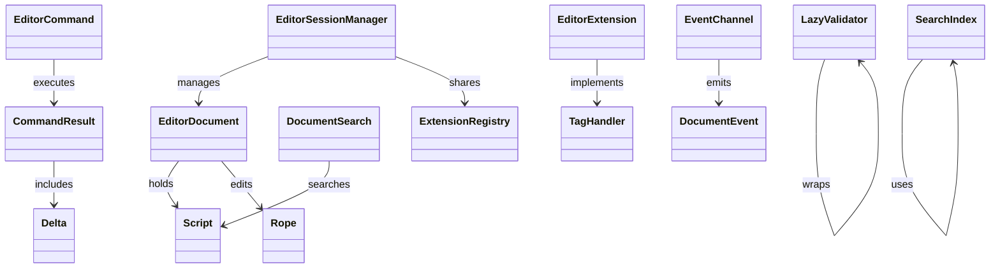

## Overview

`ass-editor` is a high-performance, ergonomic editor layer built atop `ass-core`, enabling interactive ASS subtitle manipulation with focus on user-friendly APIs (builders, macros, fluent chaining) while maintaining zero-copy efficiency (spans from core), incremental updates (<1ms edits, <5ms re-parses), and thread-safety (Send+Sync commands). It surpasses libass's lack of editor support (libass is just a renderer with global state bugs, forcing forks like Aegisub to duplicate parsing inefficiently) by reusing core's modularity: Delegate parsing to `ass-core::Script::parse_partial()`, analysis/linting via core modules, and extensibility through shared `ExtensionRegistry`. Critically, avoid libass pitfalls like strdup copies—use lifetimes `'a` for borrows, optional arenas (bumpalo) for histories, and lazy validation to cap memory at ~1.2x script size.

Core functionalities:
- Document management: Multi-session support (tabs/batches) with pooled resources.
- Commands: Fluent, undoable edits with core deltas.
- Search/Events: Reactive channels, core-indexed queries.
- Ergonomics: Builders for positions/commands, macros for shorthands.

Targets: Edits <1ms, session switches <100µs; memory ~input + minimal overhead.

## Key Principles

- **Performance Priority**: Incremental via core's partial parse; SIMD from core if featured. Builders infer without extra scans.
- **Memory Efficiency**: Borrowed spans in Rope; shared arenas for histories; Cow for own/borrow flexibility in sessions.
- **Ergonomics**: Fluent APIs (e.g., `doc.at(pos).insert_text()`), macros (e.g., `edit_event!`), optional async.
- **Modularity and Reusability**: Submodules (e.g., `commands/mod.rs`); traits like `DocumentSearch` impl'd on core `Script`.
- **Extensibility**: Reuse core plugins; editor-specific hooks (e.g., auto-complete).
- **Thread-Safety**: Arc/Mutex feature-gated for multi-thread sessions; default single-thread Rc.
- **Compliance**: Full spec integration via core (tcax.org specs, aegisub.org tags, libass wiki extensions).

## Dependencies and Feature Flags

- **External Dependencies** (minimal):
  - `ass-core = { path = "../ass-core" }`: Core parsing/analysis.
  - `ropey = "1.7"`: Lighter rope for text edits (~100KB vs xi-rope's 200KB); feature-gated.
  - `bumpalo = "3.14"`: Arenas for pooling (histories, deltas).
  - `thiserror = "1.0"`: Error handling (no anyhow to reduce bloat).
  - `fst = "0.4.7"`: Trie-based search indexing for regex-heavy queries (WASM perf notes: fallback linear search on mobile).
  - Avoid heavy deps like tokio unless "async" featured.

- **Feature Flags** (mirror core's for consistency):
  - `"analysis"` (default): Core linting/validation.
  - `"plugins"` (default): Shared registry.
  - `"rope"`: Ropey for text editing (lighter than xi-rope alternative).
  - `"undo-limit=50"`: Configurable undo depth (arena-pooled to cap memory).
  - `"serde"`: Derives for export.
  - `"simd"`: Core SIMD passthrough.
  - `"arena"`: Bumpalo for sessions with arena reset on close.
  - `"async"` (careful): Async commands for UIs only when needed (avoid bloat).
  - `"multi-thread"`: Arc/Mutex for sessions.
  - `"search-index"`: Trie-based indexing for fast regex/fuzzy search.
  - `"no_std"`: Alloc-only (hashbrown for maps, core spans for <100KB savings).
  - `"benches"`: Criterion for perf tests.

Expectations: Lean crate (~80KB with ropey vs 150KB with xi-rope); aggressive no_std saves ~100KB for WASM editors.

## Architecture

High-level: Editor proxies core (Document holds `Script<'a>`); sessions manage multiples with shared resources. Commands delta-apply; events via channels.

Text-based diagram:
```
User Input ─► SessionManager (multi-docs, shared registry/arena) ─► EditorDocument (Rope + Script<'a>)
              │
              ├► Commands (fluent builders, macros → core Delta)
              │
              └► Extensions/Events (channels, core hooks) ─► Analysis (lint, search via core indexes)
```

- **Data Flow**: Input → Rope delta → Core partial parse → Updated Script.
- **Error Handling**: CoreError wrapped; partial recovery with warnings.
- **Lifetime Management**: `'a` from core; owned fallback in multi-thread.
- **Optimization Hooks**: Core SIMD/tokenizer for highlights; arena reset on close.



## Folder Structure and Modules

No flat `src/`; subdirs with `mod.rs` for isolation.

```
crates/ass-editor/
├── Cargo.toml  # Deps/features as above
├── lib.rs      # Re-exports (e.g., pub mod core; pub use core::EditorDocument;)
├── core/       # Base structures
│   ├── mod.rs  # EditorDocument<'a> { script: Script<'a>, text_rope: Rope (ropey), ... }
│   ├── position.rs  # PositionBuilder, DocumentPosition
│   ├── history.rs   # UndoStack with core Delta pooling in arena. Limit UndoStack depth=50; reset arena on exceed to prevent accumulation
│   └── errors.rs    # EditorError (wraps CoreError, no anyhow)
├── commands/   # Editable actions
│   ├── mod.rs  # EditorCommand trait; fluent TextCommand
│   └── macros.rs  # Proc-macros for edit_event! etc.
├── sessions/   # Multi-doc handling
│   ├── mod.rs  # EditorSessionManager<'a> { sessions: HashMap, shared_arena: Bump with reset }
│   └── memory.rs    # Arena reset logic to prevent libass-style leaks
├── extensions/ # Hooks
│   ├── mod.rs  # EditorExtension trait (impl core TagHandler + extras)
│   └── builtins/  # e.g., syntax_highlight.rs, auto_complete.rs
├── formats/    # IO
│   ├── mod.rs  # Importer/Exporter traits (proxy core parse/serialize)
│   └── ass.rs     # AssImporter, AssExporter
├── events/     # Reactivity
│   ├── mod.rs  # DocumentEvent enum, EventChannel (mpsc)
│   └── extension.rs  # ExtensionEvent enum
├── utils/      # Helpers
│   ├── mod.rs  # SearchOptions builder
│   ├── search.rs   # DocumentSearch trait with trie-based indexing. WASM opt: If fst regex slow, fallback to core linear (benchmark <1ms)
│   ├── indexing.rs # FST-based search index for regex/fuzzy queries
│   └── validator.rs  # LazyValidator wrapper. Support core's new unicode-wrap feature; lint LayoutRes mismatches in validator.rs
└── benches/    # Perf tests (criterion: multi-session edits)
```

## Interactions with ASS-Core

- **Parsing**: `EditorDocument::from_str(text)` → `ass-core::Script::parse(text)`; incremental: `script.parse_partial(range)`.
- **Analysis/Linting**: `doc.validate_partial()` → core `LazyValidator`; `analysis_update` from `ScriptAnalysis`.
- **Plugins**: Shared `ExtensionRegistry`: Register editor exts (e.g., `SyntaxHighlightExtension` impls core `TagHandler` for tag parsing).
- **Rendering Prep**: Hook core `TagComputedValues` for previews (no full render; defer to ass-renderer).
- **Search/Indexing**: `doc.search()` → FST-based trie index for fast regex queries on 1000+ events (fallback to core linear search).
- **Events**: Core events (e.g., `AnalysisUpdated`) wrapped in `DocumentEvent`; broadcast in sessions.
- **Memory/Perf Sync**: Use core arenas/SIMD; editor adds ropey for edits, arena resets prevent leaks. Undo/redo via pooled Deltas.
- **Async Handling**: Feature-gated async only for UI responsiveness; avoid unnecessary futures bloat in CLI integrations.

Critique: Superior to libass (no sessions, inefficient globals) and Aegisub (single-thread forks). Ropey reduces deps vs xi-rope; FST indexing handles large scripts. Watch lifetime complexity in sessions—test for borrows. Arena resets prevent accumulation. Extend via registry without forks.