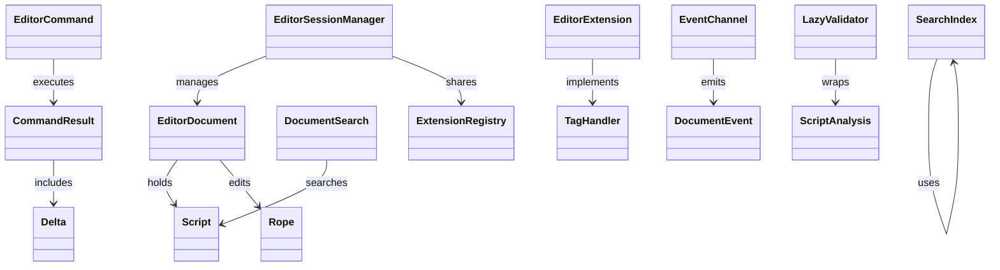

## Overview

`ass-editor` is a high-performance, ergonomic editor layer built atop `ass-core`, enabling interactive ASS subtitle manipulation with focus on user-friendly APIs (builders, macros, fluent chaining) while maintaining zero-copy efficiency (spans from core), incremental updates (<1ms edits, <5ms re-parses), and thread-safety (implicit Send+Sync via core's immutable Script design). It surpasses libass's lack of editor support (libass is just a renderer with global state bugs, forcing forks like Aegisub to duplicate parsing inefficiently) by reusing core's modularity: Delegate parsing to `ass-core::Script::parse_partial()`, analysis/linting via core modules, and extensibility through shared `ExtensionRegistry`. Critically, avoid libass pitfalls like strdup copies—use lifetimes `'a` for borrows, optional arenas (bumpalo) for histories, and lazy validation to cap memory at ~1.2x script size.

Core functionalities:
- Document management: Multi-session support (tabs/batches) with pooled resources.
- Commands: Fluent, undoable edits with core deltas.
- Search/Events: Reactive channels, core-indexed queries.
- Ergonomics: Builders for positions/commands, macros for shorthands.

Targets: Edits <1ms, session switches <100µs; memory ~input + minimal overhead.

## Key Principles

- **Performance Priority**: Incremental via core's partial parse; SIMD from core if featured. Builders infer without extra scans.
- **Memory Efficiency**: Borrowed spans in Rope; shared arenas for histories; Cow for own/borrow flexibility in sessions.
- **Ergonomics**: Fluent APIs (e.g., `doc.at(pos).insert_text()`), macros (e.g., `edit_event!`), optional async.
- **Modularity and Reusability**: Submodules (e.g., `commands/mod.rs`); traits like `DocumentSearch` impl'd on core `Script`.
- **Extensibility**: Reuse core plugins; editor-specific hooks (e.g., auto-complete).
- **Thread-Safety**: Arc/Mutex feature-gated for multi-thread sessions; default single-thread Rc.
- **Compliance**: Full spec integration via core (tcax.org specs, aegisub.org tags, libass wiki extensions).

## Dependencies and Feature Flags

- **External Dependencies** (minimal):
  - `ass-core = { path = "../ass-core" }`: Core parsing/analysis.
  - `ropey = "1.6.1"`: Lighter rope for text edits (~100KB vs xi-rope's 200KB); feature-gated.
  - `bumpalo = "3.14"`: Arenas for pooling (histories, deltas).
  - `thiserror = "1.0"`: Error handling (no anyhow to reduce bloat).
  - `fst = "0.4.7"`: Trie-based search indexing for regex-heavy queries (WASM perf notes: fallback linear search on mobile).
  - Avoid heavy deps like tokio unless "async" featured.

  > **Status (2026-06):** Beyond this minimal list, several deps are present
  > (all feature-gated): `parking_lot` (multi-thread), `futures` + `tokio`
  > (async), `regex` (formats), `fst` (search-index), `hashbrown` (nostd maps),
  > `serde`, and `static_assertions` (concurrency compile-time checks). `ropey`
  > is pinned at `1.6.1` (not `1.7`).

- **Feature Flags** (mirror core's for consistency):

  > **Status (2026-06):** The crate uses a two-tier feature model, not a flat
  > flag set. Main flavors select bundles of granular features:
  > - `"default"` = `"full"`.
  > - `"minimal"`: alloc-only core editing (`rope`, `arena`, `stream`,
  >   `hashbrown`); `nostd`-compatible.
  > - `"full"`: builds on `minimal` + `std`, `analysis`, `plugins`, `formats`,
  >   `search-index`, `concurrency`, `serde`, `thiserror`.

  Granular features (typically pulled in by `minimal`/`full`):
  - `"std"`: Standard library support (propagates to core/ropey/bumpalo).
    Mutually exclusive with `"nostd"`.
  - `"analysis"`: Core linting/validation.
  - `"plugins"`: Shared registry.
  - `"stream"`: Incremental parsing (essential for editing performance).
  - `"rope"`: Ropey for text editing (lighter than xi-rope alternative).
  - `"arena"`: Bumpalo for sessions with arena reset on close.
  - `"formats"`: SRT/WebVTT import/export (requires `std`; pulls `regex`).
  - `"search-index"`: Trie-based indexing for fast regex/fuzzy search
    (requires `std`; pulls `fst`).
  - `"serde"`: Derives for export (requires `std`).
  - `"concurrency"`: Bundles `multi-thread` + `async` (requires `std`).
  - `"multi-thread"`: `parking_lot`-backed sessions.
  - `"async"` (careful): Async commands for UIs only when needed (avoid bloat).

  Optional/specialized:
  - `"simd"` / `"simd-full"`: Core SIMD passthrough.
  - `"nostd"`: Alloc-only (hashbrown for maps, core spans for <100KB savings).
    Mutually exclusive with `"std"`.
  - `"dev-benches"`: Development benchmarking features.

  > **Status (2026-06):** There is **no** compile-time `"undo-limit=50"`
  > feature. Undo depth is configured at **runtime** via `UndoStackConfig`,
  > e.g. `doc.undo_manager_mut().set_config(UndoStackConfig { max_entries, .. })`.

Expectations: Lean crate (~80KB with ropey vs 150KB with xi-rope); aggressive nostd saves ~100KB for WASM editors.

## Architecture

High-level: Editor proxies core (Document holds `Script<'a>`); sessions manage multiples with shared resources. Commands delta-apply; events via channels.

Text-based diagram:
```
User Input ─► SessionManager (multi-docs, shared registry/arena) ─► EditorDocument (Rope + Script<'a>)
              │
              ├► Commands (fluent builders, macros → core Delta)
              │
              └► Extensions/Events (channels, core hooks) ─► Analysis (lint, search via core indexes)
```

- **Data Flow**: Input → Rope delta → Core partial parse → Updated Script.
- **Error Handling**: CoreError wrapped; partial recovery with warnings.
- **Lifetime Management**: `'a` from core; owned fallback in multi-thread.
- **Optimization Hooks**: Core SIMD/tokenizer for highlights; arena reset on close.


```mermaid
classDiagram
    class EditorSessionManager {
    }
    class EditorDocument {
    }
    class Script {
    }
    class Rope {
    }
    class EditorCommand {
    }
    class CommandResult {
    }
    class Delta {
    }
    class DocumentSearch {
    }
    class EditorExtension {
    }
    class TagHandler {
    }
    class LazyValidator {
    }
    class SearchIndex {
    }
    class EventChannel {
    }
    class DocumentEvent {
    }

    EditorSessionManager --> EditorDocument : manages
    EditorSessionManager --> ExtensionRegistry : shares
    EditorDocument --> Script : holds
    EditorDocument --> Rope : edits
    EditorCommand --> CommandResult : executes
    CommandResult --> Delta : includes
    DocumentSearch --> Script : searches
    EditorExtension --> TagHandler : implements
    LazyValidator --> ScriptAnalysis : wraps
    SearchIndex --> SearchIndex : uses
    EventChannel --> DocumentEvent : emits
```

## Folder Structure and Modules

No flat `src/`; subdirs with `mod.rs` for isolation.

```
crates/ass-editor/
├── Cargo.toml  # Deps/features as above
├── lib.rs      # Re-exports (e.g., pub mod core; pub use core::EditorDocument;)
├── core/       # Base structures
│   ├── mod.rs  # EditorDocument<'a> { script: Script<'a>, text_rope: Rope (ropey), ... }
│   ├── document.rs  # EditorDocument impl, doc-id generation
│   ├── fluent.rs    # Fluent edit API (doc.at(pos).insert_text() etc.)
│   ├── builders.rs  # Position/command builders
│   ├── thread_safety.rs # Send+Sync assertions (static_assertions)
│   ├── incremental.rs   # Incremental re-parse glue (stream feature)
│   ├── position.rs  # PositionBuilder, DocumentPosition
│   ├── history.rs   # UndoStack with core Delta pooling in arena. Depth configured at runtime via UndoStackConfig (not a compile-time limit)
│   └── errors.rs    # EditorError (wraps CoreError, no anyhow)
├── commands/   # Editable actions
│   ├── mod.rs  # EditorCommand trait; fluent TextCommand
│   └── macros.rs  # Proc-macros for edit_event! etc.
├── sessions/   # Multi-doc handling
│   ├── mod.rs  # EditorSessionManager<'a> { sessions: HashMap, shared_arena: Bump with reset }
│   └── memory.rs    # Arena reset logic to prevent libass-style leaks
├── extensions/ # Hooks
│   ├── mod.rs  # EditorExtension trait (impl core TagHandler + extras)
│   └── builtin/   # e.g., syntax_highlight.rs, auto_complete.rs
├── formats/    # IO
│   ├── mod.rs  # Importer/Exporter traits (proxy core parse/serialize)
│   ├── ass/       # AssImporter, AssExporter
│   ├── srt/       # SRT import/export
│   └── webvtt/    # WebVTT import/export
├── events/     # Reactivity
│   └── mod.rs  # DocumentEvent + ExtensionEvent enums, EventChannel (mpsc)
├── utils/      # Helpers
│   ├── mod.rs  # SearchOptions builder
│   ├── search.rs   # DocumentSearch trait with trie-based indexing. WASM opt: If fst regex slow, fallback to core linear (benchmark <1ms)
│   ├── indexing.rs # FST-based search index for regex/fuzzy queries
│   └── validator.rs  # LazyValidator implementation wrapping core's ScriptAnalysis. Support core's unicode-wrap feature; lint LayoutRes mismatches
└── benches/    # Perf tests (criterion: multi-session edits)
```

> **Status (2026-06):** The actual tree drifts from this spec in a few places:
> there is **no** `events/extension.rs` (the `ExtensionEvent` enum lives in
> `events/mod.rs`); `formats/` uses per-format subdirs (`ass/`, `srt/`,
> `webvtt/`) rather than flat files; the built-ins directory is `extensions/builtin/`
> (singular); and `core/` carries extra modules beyond the spec (`document.rs`,
> `fluent.rs`, `builders.rs`, `thread_safety.rs`, `incremental.rs`).
>
> The `<200 LOC per file` modularity target is aspirational and currently
> exceeded by several files (notably `core/fluent.rs` and `core/document.rs`).

## Interactions with ASS-Core

- **Parsing**: `EditorDocument::from_str(text)` → `ass-core::Script::parse(text)`; incremental: `script.parse_partial(range)`.
- **Analysis/Linting**: `doc.validate_partial()` → editor's `LazyValidator` wrapper around core's `ScriptAnalysis`; `analysis_update` from `ScriptAnalysis`.
- **Plugins**: Shared `ExtensionRegistry`: Register editor exts (e.g., `SyntaxHighlightExtension` impls core `TagHandler` for tag parsing).
- **Rendering Prep**: Hook core `TagComputedValues` for previews (no full render; defer to ass-renderer).
- **Search/Indexing**: `doc.search()` → FST-based trie index for fast regex queries on 1000+ events (fallback to core linear search).
- **Events**: Core events (e.g., `AnalysisUpdated`) wrapped in `DocumentEvent`; broadcast in sessions.
- **Memory/Perf Sync**: Use core arenas/SIMD; editor adds ropey for edits, arena resets prevent leaks. Undo/redo via pooled Deltas.
- **Async Handling**: Feature-gated async only for UI responsiveness; avoid unnecessary futures bloat in CLI integrations.

Critique: Superior to libass (no sessions, inefficient globals) and Aegisub (single-thread forks). Ropey reduces deps vs xi-rope; FST indexing handles large scripts. Watch lifetime complexity in sessions—test for borrows. Arena resets prevent accumulation. Extend via registry without forks.

## Implementation Notes

Based on ass-core analysis:
- **LazyValidator**: Not provided by core; implement in editor as wrapper around `ScriptAnalysis` for on-demand validation
- **Thread-safety**: Core's `Script<'a>` has immutable design but lacks explicit Send+Sync bounds (would require unsafe); rely on implicit safety
- **All other features ready**: Delta tracking, plugin system, incremental parsing, SIMD, arenas all available in core
- **Document ID generation (no_std)**: Now uses `core::sync::atomic::AtomicU32` (see `core/document.rs`); the earlier `unsafe static mut` counter is gone, so the crate is once again unsafe-free, consistent with the project's "no unsafe" rule.
