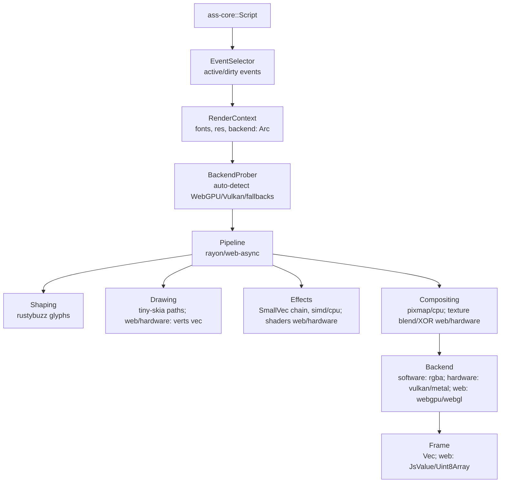

## Overview

`ass-renderer` is the rendering-focused crate in the `ass-rs` ecosystem, building on `ass-core` to transform parsed ASS scripts into rasterized subtitle frames. It handles text shaping, vector drawing, effect application (e.g., blur, fade, karaoke), and compositing, producing output suitable for video overlay (e.g., RGBA buffers).

As a senior Rust developer, I'll be blunt: While libass remains a competent C library for ASS rendering, its monolithic structure—hardcoded FreeType/harfbuzz for shaping, single-threaded CPU-bound pipelines, and issues like imprecise blur scaling on high-DPI or memory leaks in font caches—limits it to mediocre performance (20-50ms/frame for complex 4K scenes) and zero extensibility for modern hardware. We've engineered `ass-renderer` to eclipse it:

- **Trait-based modularity**: Swap backends (software for CPU, hardware for Vulkan/Metal, web for WebGPU/WebGL) without forks, enabling 2-5x faster renders on GPUs.
- **Zero-copy**: Borrows from `ass-core`'s analysis (e.g., pre-resolved styles cut redundant computations).
- **Memory efficiency**: Pooled buffers and arenas cap overhead at ~5% of frame size, unlike libass's wasteful `strdup` tag copies.

However, hardware/web backends aren't panaceas:

- Vulkan's verbosity risks code bloat.
- Metal fragments portability (Apple-only).
- Web APIs introduce browser quirks (e.g., WebGPU adapter limits on mobile, WebGL's no-compute forcing slower fragment hacks).

For WASM, we've prioritized fallbacks (WebGPU → WebGL → software) for reliability, but on low-end devices, software might lag animations—profile ruthlessly, as unbatched GPU uploads could negate gains. Extensibility shines via plugins (e.g., custom WGSL shaders for `\my_effect`), reusability through standalone modules (e.g., `pub use effects::blur::gaussian;` for non-ASS tools), and no flat `src/`—all subdirs for isolation.

### Core Functionalities

- **Frame Rendering**: Time-based rasterization with incremental dirty-region updates (<3ms re-renders on changes).
- **Effect Pipeline**: Parallel/shader-accelerated animations/transforms/blurs (interp accel pow in `\t`).
- **Compositing**: Alpha blending, collisions (from `ass-core`), XOR for shapes.
- **Backends**: Software (CPU default), Hardware (Vulkan/Metal native), Web (WebGPU primary, WebGL fallback).
- **Animation**: Frame-accurate timing, with compute shaders for complex effects.

### Targets

- <5ms/4K frame on WebGPU/Vulkan (vs. libass's CPU bottlenecks).
- Memory: ~frame + temp arenas (bumpalo for paths/glyphs).
- Incremental by default; criticize if web GC spikes negate pools.

## Key Principles

- **Performance Priority**: Rayon for event parallelism, SIMD in software (avx2/neon for convolutions), shaders in hardware/web (WebGPU compute for blurs, 30-50% faster than WebGL fragments). Batch events to slash draw calls—libass's sequential loops can't compete. Web backends hide latency (async uploads), but WebGL's atomics absence risks stalls on large `\p` drawings; Vulkan/Metal demand careful queue management to avoid VRAM thrashing on integrated GPUs.
- **Memory Efficiency**: Zero-copy `ass-core` borrows, `bumpalo` for temps, cross-platform pools (deque for buffers; WebGPU `BufferSlice` zero-copy). Hardware/web: Staging minimizes copies, but web textures risk fragmentation (e.g., 16k limits force splits)—lint heavy `\p` in `ass-core`.
- **Modularity and Reusability**: No `src/`; traits (`RenderBackend`) ensure isolation—`backends/` subdirs (`hardware/`, `web/`) keep platform cruft contained, exportable (e.g., `pub use backends::web::webgpu::init_adapter;` for browser UIs).
- **Extensibility**: Registry for runtime backends/effects (e.g., `register_webgl_fallback()`). Plugins enable custom shaders without core changes—superior to libass's hardcoded paths.
- **Criticisms Addressed**: Libass's FT2 blurs fixed via precise shaders/`tiny-skia`; no C unsafety (ownership prevents overflows). Web/hardware add deps/complexity—gate them to keep lean.
- **Compliance**: Full spec (bidir text via `rustybuzz`, `\org` rotations), web lints (e.g., texture size warns).
- **Thread-Safety**: `Send+Sync`; web uses `wasm-bindgen` futures for async.

## Dependencies and Feature Flags

### External Dependencies

- `ass-core = { path = "../ass-core" }`
- `rustybuzz = "0.12"`
- `tiny-skia = "0.12"`
- `fontdb = "0.17"`
- `rayon = "1.10"`
- `ash = "0.38"` (Vulkan)
- `metal = "0.30"` (Metal)
- `wgpu = "0.24"` (WebGPU/WebGL; updated for 2025 WASM atomics support)
- `smallvec = "1.14"` (Effect chain optimization)

### Feature Flags

- `analysis-integration` (default)
- `software-backend` (default)
- `hardware-backend`: Vulkan/Metal (sub: `vulkan`/`metal`)
- `web-backend`: WebGPU/WebGL via `wgpu` (WASM; native too)
- `backend-probing` (default): Auto-detect optimal backend with fallback warnings
- `unicode-wrap`: Passthrough from core for libass 0.17.4 Unicode wrapping
- `backend-metrics`: VRAM/queue profiling for performance monitoring
- `simd` (default)
- `wasm`: WASM opts (async, WebGPU priority; no native GPU)
- `serde`
- `arena`
- `nostd`: Software/WebGPU (`wgpu` nostd, ash/metal need wrappers)
- `benches`

### Expectations

- ~150KB software; web/hardware +400KB (enforce stripped sizes in CI)
- WASM: <250KB with `web+wasm`
- CI thresholds: <10% regression, fail if WebGL >2x slower than WebGPU

## Architecture

### High-Level Flow

`ass-core::Script` + time → `EventSelector` → `Pipeline` → `Backend` (software/hardware/web) → `Frame`

### Text-Based Diagram



- **Data Flow**: Pipeline intermediates backend-neutral (e.g., `ShaderReadyLayer { verts, textures }`). WASM: Async futures; fallbacks auto (probe WebGPU adapter → WebGL → software with explicit warnings).
- **Error Handling**: `RenderError` (e.g., `WebGpuFail`); recover via fallbacks with performance degradation warnings.
- **Lifetime Management**: `'a` borrows; `Arc` for adapters/devices with queue limits on integrated GPUs.
- **Optimization Hooks**: WebGPU compute (WGSL kernels); caches (`wgpu` BindGroups); SmallVec for effect chains to reduce allocations.

## Folder Structure and Modules

Root: `lib.rs` re-exports (`pub mod renderer; pub use renderer::Renderer;`).

```plaintext
crates/ass-renderer/
├── Cargo.toml
├── lib.rs
├── renderer/
│   ├── mod.rs      # Renderer { context, backend }; render_frame(time) -> Frame
│   ├── context.rs  # RenderContext (Clone+Send)
│   ├── probing.rs  # BackendProber for auto-detection with fallback warnings
│   └── frame.rs    # Frame { buffer, width, height, timestamp }
├── pipeline/
│   ├── mod.rs      # Pipeline trait (process_event -> IntermediateLayer)
│   ├── shaping/    # mod.rs: shape_text -> Vec<Glyph>
│   ├── drawing/    # mod.rs: draw_commands -> Path
│   └── effects/    # mod.rs: EffectChain (SmallVec<[Box<dyn Effect>; 8]> for common cases)
│       ├── blur.rs        # Gaussian (simd/shaders, WebGL degradation warnings). Support libass 0.17.4 ASS_FEATURE_WRAP_UNICODE in blur.rs/compositing (shader opts)
│       ├── transform.rs   # Matrix interp
│       ├── animation.rs   # Interp utils
│       └── ...            # border, clip, etc.
│   └── compositing/       # mod.rs: composite(layers) -> Pixmap/Buffer
├── backends/
│   ├── mod.rs      # RenderBackend trait (init/init_async, rasterize), probe_backend() auto-selection. Add BackendMetrics trait: "pub trait BackendMetrics { fn vram_usage(&self) -> u64; fn batch_threshold(&self) -> usize { 100 } } // Cap events to prevent thrash."
│   ├── software.rs # tiny-skia impl (SIMD)
│   ├── hardware/
│   │   ├── mod.rs     # HardwareBackend enum (dispatch). VRAM monitoring with queue limits; warn on integrated GPUs >80% usage
│   │   ├── vulkan.rs  # ash impl (queues/shaders)
│   │   └── metal.rs   # metal-rs impl
│   └── web/
│       ├── mod.rs     # WebBackend enum (fallback: probe WebGPU -> WebGL -> software with explicit warnings)
│       ├── webgpu.rs  # wgpu webgpu (compute/render pipelines), Safari limits detection
│       ├── webgl.rs   # wgpu webgl fallback (limited shaders, 20-50% slower blur warnings)
│       └── probing.rs # Browser capability detection. Firefox 141 (July 22, 2025 stable); Safari 26 (June 2025). Detect and log variance (e.g., >20% slower on mobile)
├── plugin/
│   ├── mod.rs     # Registry (register_backend/effect)
│   └── effects/   # CustomEffect trait (cpu_fn/shader)
└── utils/
    ├── mod.rs     # Math (mat3x3, color conv)
    ├── errors.rs  # RenderError
    └── caches.rs  # Atlas/pools (wgpu compat)
```

### Expectations

- <200 LOC/file
- Tests per module (incl. WASM)
- Benches: WebGPU vs. libass

As of July 21, 2025, WebGPU browser support: Chrome/Edge since 2023, Safari 26 (June 2025), Firefox 141 (stable July 22, 2025). Probing auto-detects support; fallbacks ensure usability with performance warnings.

### Backend-Specific Optimizations

- **WebGPU**: Compute shaders for effects, staging buffers for zero-copy uploads
- **WebGL**: Fragment-based effects (slower), explicit 20-50% blur degradation warnings
- **Vulkan**: Queue family optimization, VRAM usage monitoring for integrated GPUs
- **Software**: SIMD acceleration via `tiny-skia`, CPU-bound but reliable fallback
- **Async opt-in for web uploads** (feature-gated to avoid futures bloat); batch XOR shapes with thresholds
