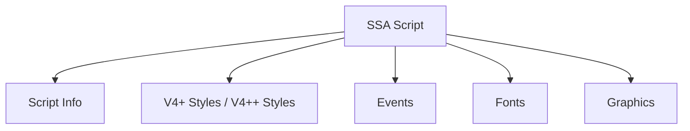
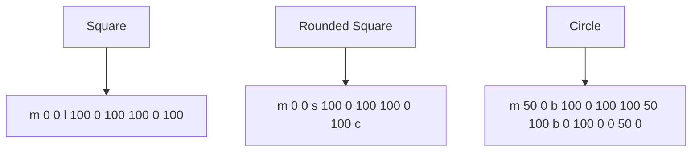

## Overview

- **Purpose**: Defines the structure and rules for SSA v4.00+ and v4.00++ scripts.
- **Compatibility**: Reads older SSA scripts; v4.00+ scripts incompatible with older versions; v4.00++ not backward compatible with v4+ renderers.
- **Format**: Plain text, editable in any text editor, but must follow strict rules.
- **Source**: Based on SSA's original specification ([http://www.eswat.demon.co.uk](http://www.eswat.demon.co.uk/)).
- **Updated for libass 0.17.4 extensions**: LayoutResX/Y, AlphaLevel, Unicode wrapping (link to wiki).

## Script Structure

### General Rules

- **Sections**: Organized in "ini file" style sections.
- **Line Descriptors**: Most lines start with a code followed by a colon.
- **Field Separation**: Commas separate fields; commas are illegal in names/styles.
- **Event Order**: Events can be in any order; SSA sorts by timing.
- **Invalid Lines**: Ignored with a warning on load.
- **Single Line Entries**: All information for an entry is in one line.
- **Unknown Styles**: Default style used if style is missing.
- **Missing Fonts**: Arial used if specified font is unavailable.
- **Time Format**: All timing values use `H:MM:SS:CC` format where CC represents centiseconds (1/100th of a second).

### Sections



#### [Script Info]

- **Purpose**: Contains headers and general script metadata.
- **First Line**: Must be `[Script Info]`.

#### [V4+ Styles] / [V4++ Styles]

- **Purpose**: Defines all styles used in the script.

#### [Events]

- **Purpose**: Contains subtitles, comments, pictures, sounds, movies, and commands.

#### [Fonts]

- **Purpose**: Stores embedded TrueType font files.
- **Format**:

    ```
    fontname: <name>_<B/I><encoding>.ttf
    ```

    Example: `fontname: chaucer_B0.ttf`
- **Encoding**: UUencoded binary, 80 characters per line.

#### [Graphics]

- **Purpose**: Stores embedded graphic files (e.g., .bmp, .jpg).
- **Format**:

    ```
    filename: <name>
    ```

- **Storage**: Saved in `Pictures` subdirectory.
- **Encoding**: UUencoded binary, 80 characters per line.

## Line Types

### Header Lines ([Script Info])

- **Comment**: `; Comment text` (invisible in SSA).
- **Title**: Script description; defaults to `<untitled>`.
- **Original Script**: Author(s); defaults to `<unknown>`.
- **Original Translation**: Translator (optional).
- **Original Editing**: Editor(s) (optional).
- **Original Timing**: Timer (optional).
- **Synch Point**: Video sync point (optional).
- **Script Updated By**: Editor groups (optional).
- **Update Details**: Update notes (optional).
- **ScriptType**: Version (e.g., `V4.00+` or `V4.00++`).
- **Collisions**: `Normal` (stack subtitles) or `Reverse` (shift upwards).
- **PlayResY**: Screen height.
- **PlayResX**: Screen width.
- **PlayDepth**: Color depth.
- **Timer**: Speed multiplier (e.g., `100.0000`).
- **WrapStyle**:
    - `0`: Smart wrapping.
    - `1`: End-of-line wrapping (\N only).
    - `2`: No wrapping (\n, \N break).
    - `3`: Smart wrapping, wider lower line.

### Style Lines ([V4+ Styles] / [V4++ Styles])

- **V4+ Format**:

    ```
    Format: Name, Fontname, Fontsize, PrimaryColour, SecondaryColour, OutlineColour, BackColour, Bold, Italic, Underline, StrikeOut, ScaleX, ScaleY, Spacing, Angle, BorderStyle, Outline, Shadow, Alignment, MarginL, MarginR, MarginV, Encoding
    ```

- **V4++ Format**:

    ```
    Format: Name, Fontname, Fontsize, PrimaryColour, SecondaryColour, OutlineColour, BackColour, Bold, Italic, Underline, StrikeOut, ScaleX, ScaleY, Spacing, Angle, BorderStyle, Outline, Shadow, Alignment, MarginL, MarginR, MarginT, MarginB, Encoding, RelativeTo
    ```

- **Fields**:
    - **Name**: Style name (case-sensitive, no commas).
    - **Fontname**: Windows font name (case-sensitive).
    - **Fontsize**: Font size.
    - **PrimaryColour**: BGR (e.g., `&HBBGGRR&`).
    - **SecondaryColour**: BGR for collision shifts.
    - **OutlineColour**: BGR for collision shifts.
    - **BackColour**: BGR for outline/shadow.
    - **Bold**: `-1` (true), `0` (false).
    - **Italic**: `-1` (true), `0` (false).
    - **Underline**: `-1` (true), `0` (false).
    - **StrikeOut**: `-1` (true), `0` (false).
    - **ScaleX/Y**: Font width/height (%).
    - **Spacing**: Character spacing (pixels).
    - **Angle**: Rotation (degrees).
    - **BorderStyle**: `1` (outline+shadow), `3` (opaque box).
    - **Outline**: Outline width (0-4 pixels).
    - **Shadow**: Shadow depth (0-4 pixels).
    - **Alignment**: `1` (left), `2` (center), `3` (right); `+4` (top), `+8` (mid).
    - **MarginL/R**: Left/Right margins (pixels).
    - **MarginV (V4+)**: Vertical margin (pixels).
    - **MarginT/B (V4++)**: Top/Bottom margins (pixels).
    - **Encoding**: Font character set (e.g., `0` for ANSI).
    - **RelativeTo (V4++)**: Positioning: `0` (window), `1` (video), `2` (script/default).

### Dialogue Event Lines ([Events])

- **V4+ Format**:

    ```
    Format: Layer, Start, End, Style, Name, MarginL, MarginR, MarginV, Effect, Text
    ```

- **V4++ Format**:

    ```
    Format: Layer, Start, End, Style, Name, MarginL, MarginR, MarginT, MarginB, Effect, Text
    ```

- **Fields**:
    - **Layer**: Integer for layering; higher layers drawn over lower.
    - **Start/End**: `H:MM:SS:CC` (hours:minutes:seconds:centiseconds, 1/100th of a second).
    - **Style**: Style name; `Default` uses script’s default.
    - **Name**: Character name (informational).
    - **MarginL/R**: Left/Right margin overrides (4-digit, pixels; `0000` uses style defaults).
    - **MarginV (V4+)**: Vertical margin override (4-digit, pixels; `0000` uses style defaults).
    - **MarginT/B (V4++)**: Top/Bottom margin overrides (4-digit, pixels; `0000` uses style defaults).
    - **Effect**:
        - `Karaoke`: Obsolete.
        - `Scroll up;y1;y2;delay[;fadeawayheight]`: Scroll text vertically.
        - `Scroll down;y1;y2;delay[;fadeawayheight]`: Scroll text vertically.
        - `Banner;delay[;lefttoright;fadeawaywidth]`: Scroll text horizontally.
    - **Text**: Subtitle text; supports `\n` and style overrides `{}`.

### Comment Event Lines ([Events])

- **Purpose**: Ignored during playback; same format as other events.

### Picture Event Lines ([Events])

- **Format**: Same as Dialogue, but `Text` is a file path (e.g., `.bmp`, `.jpg`, `.png`).
- **Style**: Ignored.
- **Margins**: Define bottom-left corner; `0000` centers horizontally/vertically.
- **Effect**: Supports `Scroll up`.

### Sound Event Lines ([Events])

- **Format**: Same as Dialogue, but `Text` is a `.wav` file path.
- **Style/Margins/End Time**: Ignored.
- **Behavior**: Plays until finished or interrupted by another sound.

### Movie Event Lines ([Events])

- **Format**: Same as Dialogue, but `Text` is an `.avi` file path.
- **Style/Effects**: Ignored.
- **Margins**: Define top-left corner; `0000` centers.
- **End Time**: Controls picture display; sound continues if longer.

### Command Event Lines ([Events])

- **Format**: Same as Dialogue, but `Text` is a program path or SSA command (e.g., `SSA:Pause`).
- **Style/Margins/Effects/End Time**: Ignored.
- **SSA Commands**:
    - `SSA:Pause`: Pauses playback.
    - `SSA:Wait for audio trigger`: Pauses until audio peak or 10-minute timeout.

## Style Override Codes

- **Syntax**: `{<code>}`; `\n`, `\N` outside braces.
- **Codes**:
    - `\n`, `\N`: Line breaks (`\n` ignored with smart wrapping).
    - `\h`: Hard space (non-breaking space).
    - `\b<0/1>`: Bold; `>1` for font weight (e.g., `400`=normal, `700`=bold).
    - `\i<0/1>`: Italic.
    - `\u<0/1>`: Underline.
    - `\s<0/1>`: Strikeout.
    - `\bord<width>`: Border width.
    - `\shad<depth>`: Shadow depth.
    - `\be<0/1>`: Blur edges.
    - `\fn<font>`: Font name.
    - `\fs<size>`: Font size.
    - `\fscx/y<percent>`: Scale X/Y.
    - `\fax/y<factor>`: Shear transformation.
    - `\fsp<pixels>`: Letter spacing.
    - `\fr[x/y/z]<degrees>`: Rotation (defaults to z-axis).
    - `\fe<charset>`: Font encoding.
    - `\c&H<bbggrr>&`: Color (RGB reversed).
    - `\1-4c&H<bbggrr>&`: Specific colors.
    - `\1-4a&H<aa>&`: Alpha channels.
    - `\alpha`: Sets all alpha channels.
    - `\a<alignment>`: Alignment (`1`=left, `2`=center, `3`=right; `+4`=top, `+8`=mid).
    - `\an<alignment>`: Numpad layout alignment.
    - `\k<duration>`: Karaoke highlight (hundredths of seconds).
    - `\kf<duration>`: Fill highlight.
    - `\ko<duration>`: Outline highlight.
    - `\kt<duration>`: Absolute karaoke syllable start time (centiseconds, V4++ only).
    - `\q<num>`: Wrapping style.
    - `\r[<style>]`: Reset to style or default.
    - `\t([t1,t2,][accel,]<modifiers>)`: Animate style modifiers (including \fax, \fay).
    - `\move(x1,y1,x2,y2[,t1,t2])`: Move text.
    - `\pos(x,y)`: Set position.
    - `\org(x,y)`: Set rotation origin.
    - `\fade(a1,a2,a3,t1,t2,t3,t4)`: Alpha animation.
    - `\fad(t1,t2)`: Fade in/out.
    - `\clip(x1,y1,x2,y2)`: Rectangular clip.
    - `\clip([scale,]<commands>)`: Shape clip.

### Drawing Commands

- **Mode**: Enabled with `\p<scale>`; `0` disables.
- **Commands**:
    - `m x y`: Move cursor.
    - `n x y`: Move cursor (unclosed shapes stay open).
    - `l x y`: Draw line.
    - `b x1 y1 x2 y2 x3 y3`: Bezier curve.
    - `s x1 y1 ... xN yN`: B-spline.
    - `p x y`: Extend B-spline.
    - `c`: Close B-spline.
    - `\pbo<y>`: Baseline offset.
- **Rules**:
    - Start with `m`.
    - Form closed shapes.
    - Unclosed shapes auto-closed with straight line.
    - Overlapping shapes XORed.
    - Coordinates relative to cursor and alignment.

### Example Drawings



## Embedded Font/Picture Encoding

- **Method**: UUEncoding.
- **Process**: Converts 3 bytes to four 6-bit numbers, adds 33 for ASCII.
- **Line Length**: 80 characters (last line may be shorter).
- **File End**: No terminator; ends at new section, filename, or script end.
