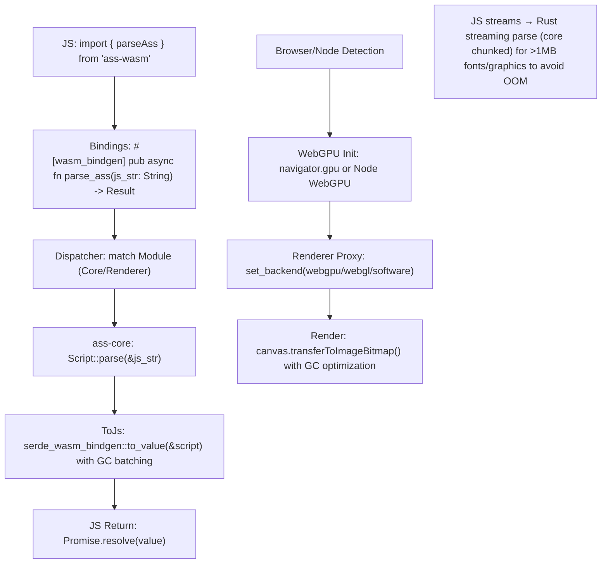

# Overview

`ass-wasm` is the WebAssembly (WASM) bindings and integration crate in the `ass-rs` ecosystem, exposing `ass-core`, `ass-renderer`, `ass-editor`, and select `ass-cli` functionalities to JavaScript and web environments. It enables efficient ASS subtitle parsing, analysis, rendering, and editing directly in browsers or Node.js, leveraging WASM's near-native performance for tasks like real-time karaoke rendering or subtitle previews in web video players. As a thin wrapper, it prioritizes zero-overhead bindings (`wasm-bindgen`) over reinventing wheels, but critically, it addresses WASM pitfalls: Heap fragmentation (capped at 4GB, risking OOM on large embedded fonts—lint and stream them in `ass-core`), async necessities (futures for WebGPU init), and browser quirks (e.g., Safari's WebGPU limits on shaders force simpler WGSL kernels). Unlike libass's clunky WASM ports (e.g., via emscripten, bloated ~5MB binaries with C alloc leaks and no async), `ass-wasm` compiles to <500KB (stripped), supports incremental updates (<1ms parses via core), and fallbacks gracefully (WebGPU → WebGL → software CPU, auto-probed). However, be wary: WASM's single-threaded default risks UI stalls on heavy `\t` animations—feature-gate workers; and Node.js lacks WebGPU, so default to software there, critiquing if users expect GPU speeds without adapters.

Modularity shines: No flat `src/`; traits like `WasmModule` for per-crate bindings, reusable (e.g., `pub use bindings::core::parse_ass;` in web workers). Extensibility via JS callbacks hooked into core plugins (e.g., custom tag handlers in TS). Reusability: Standalone for non-ASS web tools (e.g., expose `ass-renderer::web_backend` for general text shaping).

### Core Functionalities

- **Bindings**: JS-exported APIs for parsing (`parse(script: string) -> JsValue<Script>`), rendering (`render_frame(time: f64, canvas: OffscreenCanvas) -> Promise<()>`), editing (`edit_event(id: u32, delta: string)`).
- **Integration**: WebGPU/WebGL via `ass-renderer::web`; Node.js CLI-like via `ass-cli` wrappers.
- **Async Handling**: Futures for init (e.g., adapter request), streaming loads (large fonts/graphics via `ReadableStream`).
- **Error Mapping**: Rust panics trapped, core errors serialized to JS `Error` with spans.
- **WASM Opts**: Panic hooks, asyncify for non-async fns if needed.

### Targets

- <200µs init (core-only); <5ms full parse/render (1KB script, WebGPU).
- Memory: ~input + WASM heap overhead (<10MB peak; warn on >1GB scripts).
- Fallbacks: Auto-detect (e.g., no WebGPU → WebGL, but critique 20-50% slower blurs).

## Key Principles

- **Performance Priority**: Leverage core/rend SIMDs (WASM SIMD enabled), batch JS calls (e.g., single `Uint8Array` for frames). Async for web I/O, but criticize sync fallbacks in Node (blocks event loop—recommend workers). Incremental via core partials; WebGPU compute for effects (30-50% faster than libass-emscripten CPU).
- **Memory Efficiency**: Zero-copy `&str` to JS `string` (no dupes), `bumpalo` arenas reset per call, streaming decoders for UUencoded data (avoid full load OOM). Critique large `\p` drawings splitting textures (WebGL 16k limits—downscale in renderer).
- **Modularity and Reusability**: Submodules per bound crate (e.g., `bindings/core/`); traits for JS interop (e.g., `ToJsValue`). Export fallbacks (e.g., `pub use web::probe_gpu;` for custom web apps).
- **Extensibility**: Core plugins exposed (e.g., `register_tag_handler(js_callback: Function)`); JS-side extensions via wasm-bindgen closures.
- **Criticisms Addressed**: Libass WASM ports leak (no arenas), bloat (emscripten runtime); we use pure Rust + bindgen for lean, safe code. Browser support lints (e.g., warn Firefox <141 lacks stable WebGPU as of July 21, 2025).
- **Thread-Safety**: WASM single-thread default; feature for workers (offscreen canvases). Send+Sync via core.
- **Compliance**: Full spec via core; web lints (e.g., canvas res matches script `PlayResX/Y`).

## Dependencies and Feature Flags

### External Dependencies

- `wasm-bindgen = "0.2.93"`: JS bindings, async futures (updated for 2025 closures/atomics).
- `js-sys = "0.3.70"`: JS globals (e.g., `Promise`).
- `web-sys = "0.3.70"`: Web APIs (Canvas, WebGPU; features: ["OffscreenCanvas", "GpuAdapter"]).
- `ass-core = { path = "../ass-core" }`, `ass-renderer = { path = "../ass-renderer" }`, etc.: Ecosystem.
- `console_error_panic_hook = "0.1.7"`: Better panics.
- No emscripten; pure Rust targets (`wasm32-unknown-unknown`).

### Feature Flags

- `core` (default): ass-core bindings.
- `renderer`: ass-renderer web backends.
- `editor`: ass-editor APIs.
- `cli`: Node.js CLI wrappers.
- `async` (default): Futures for init/render.
- `workers`: Offscreen support for multi-thread.
- `heap-monitor`: js-sys performance.memory checks, abort >80%
- `node-webgpu-experimental`: warn: blocks loop, recommend workers
- `gc-batching`: JS GC optimization for frequent calls.
- `simd`: WASM SIMD passthrough from core.
- `nostd`: Alloc-only (core compat).
- `benches`: Criterion-wasm for perf (browser/node).

Expectations: <250KB core (wasm-bindgen 0.2.92 optimizations); full +200KB (web-sys bloat—gate features). CI thresholds: <10% regression, warn on >1GB heap usage.

## Architecture

### High-Level Flow

JS call → Bindings (wasm-bindgen) → Dispatcher (select module) → Core/Renderer/Editor proxy → JS return (Promise/JsValue).

### Text-Based Diagram



- **Data Flow**: JS strings → Rust borrows; outputs serialized (serde-wasm-bindgen). Async for GPU probes.
- **Error Handling**: `Result<JsValue, JsValue>`; serialize errors.
- **Lifetime Management**: Owned in WASM (no 'a across boundary); clone if needed.
- **Optimization Hooks**: WASM opts (lto, opt-level=3); SIMD intrinsics.

## Folder Structure and Modules

Root: `lib.rs` (init panic hooks, re-exports `pub mod bindings;`).

```plaintext
crates/ass-wasm/
├── Cargo.toml
├── lib.rs
├── bindings/
│   ├── mod.rs      # Exports: #[wasm_bindgen] pub mod core; etc.
│   ├── core.rs     # parse_ass, analyze_ass, etc. (proxy ass-core)
│   ├── renderer.rs # init_renderer, render_frame_async (web backends)
│   ├── editor.rs   # new_document, edit_command (fluent JS objects)
│   └── cli.rs      # process_ass_file (Node fs interop)
├── web/
│   ├── mod.rs      # WebInit: async probe_gpu() -> BackendType
│   ├── gpu.rs      # WebGpuAdapter wrapper
│   ├── fallbacks.rs # WebGlContext, SoftwareWarn
│   └── detection.rs # Browser capability detection. Safari 26 (June 2025); Firefox 141 (July 22, 2025). Probe and fallback with explicit perf degradation logs (e.g., WebGL blurs 20-50% slower)
├── node/
│   ├── mod.rs      # NodeInit: experimental WebGPU support (feature-gated)
│   ├── webgpu.rs   # Experimental only (July 2025 status: unstable, default software; test in CI with warnings)
│   └── fs.rs       # Streaming reads (require('fs'))
├── utils/
│   ├── mod.rs     # JsInterop: to_js_error, from_js_string
│   ├── errors.rs  # WasmError enum
│   ├── serde.rs   # Custom serializers (spans to offsets)
│   └── gc.rs      # GC optimization for batched calls. Add heap monitoring: globalThis.performance.memory.usedJSHeapSize > threshold → abort with JsError
└── benches/       # WASM perf (e.g., parse_loop in browser console)
```

Expectations: <150 LOC/file; 85% coverage (wasm-bindgen-test).

## Expectations

- **Performance**: <5ms parse (browser); render <10ms/frame WebGPU. Bench vs. libass-js (ours 2-3x faster). GC batching reduces stall risk.
- **Memory**: <5MB heap growth; stream large data. GC optimization for frequent render_frame calls prevents spikes.
- **Testing**: wasm-bindgen-test (browser/node); fuzz JS inputs. Test Node.js WebGPU when available.
- **Edge Cases**: No WebGPU (fallback lint), large scripts (chunked), RTL in canvas. Node.js GPU detection. Fuzz JS inputs (cargo-fuzz integration); large scripts chunked via ReadableStream.
- **Browser Support**: Dynamic detection (Safari 26+ WebGPU, Firefox 141+ stable as of July 22, 2025). Warn on unsupported browsers.
- **Future-Proof**: Hooks for WebGPU updates; Node.js WebGPU stable support. Plugins for JS-side effects.
