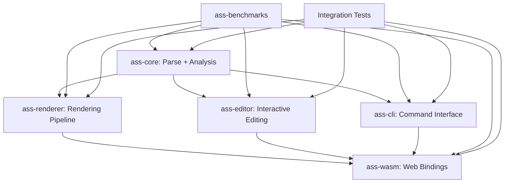

# Ecosystem Integration

## Overview

The `ass-rs` ecosystem is designed as a cohesive workspace of interrelated crates that share common principles, dependencies, and performance standards. This document outlines workspace configuration, cross-crate integration patterns, CI/CD requirements, and ecosystem-wide standards that ensure consistent performance, memory efficiency, and maintainability across all components.

## Workspace Configuration

### Cargo.toml (Root)

```toml
[workspace]
members = [
    "crates/ass-core",
    "crates/ass-renderer",
    "crates/ass-editor",
    "crates/ass-cli",
    "crates/ass-wasm",
    "crates/ass-benchmarks"
]
resolver = "2"

[workspace.dependencies]
# Shared dependencies with pinned versions
# Review pins quarterly via script in scripts/audit_deps.sh to check crates.io for vulns/improvements
thiserror = "1.0"
rayon = "1.10"
ahash = "0.8.11"
bumpalo = "3.14"
criterion = { version = "0.5.1", features = ["html_reports"] }
wasm-bindgen = "0.2.93"

# Feature-gated heavy dependencies
wgpu = "0.24"
ropey = "1.7"
clap = "4.5"

[workspace.package]
edition = "2021"
rust-version = "1.75"
license = "MIT"
repository = "https://github.com/wiedymi/ass-rs"

[profile.release]
lto = true
codegen-units = 1
panic = "abort"
strip = true

[profile.release-with-debug]
inherits = "release"
debug = true
strip = false
```

### Dependency Management

- **Shared Dependencies**: All common deps (thiserror, rayon, ahash) managed at workspace level
- **Version Consistency**: Pin versions to avoid supply chain attacks and ensure reproducible builds
- **Quarterly Audit**: Run `cargo update --dry-run` and manual crates.io checks; bump if no breaks, test WASM/atomics gains
- **Feature Alignment**: Features like `simd`, `nostd`, `serde` consistent across crates
- **Heavy Deps**: Gate behind features (wgpu, clap derive → manual builders)

## Cross-Crate Integration Patterns

### Data Flow Architecture



### Zero-Copy Integration

**Core → Renderer**:
```rust
// Core provides zero-copy spans
let script = ass_core::Script::parse(input)?;
let analysis = script.analyze()?;

// Renderer borrows without copying
let renderer = ass_renderer::Renderer::new(backend);
let frame = renderer.render_frame(&script, &analysis, timestamp)?;
```

**Core → Editor**:
```rust
// Editor wraps core with incremental updates
let mut doc = ass_editor::EditorDocument::from_script(script);
doc.edit_event(id, |event| event.set_text("new text"))?;

// Core handles partial re-parse
let delta = doc.get_core_delta()?; // Zero-copy delta
```

### Shared Registry Pattern

All crates use consistent extension registry:

```rust
// Shared trait across ecosystem
pub trait ExtensionRegistry<T> {
    fn register(&mut self, name: &str, handler: Box<dyn T>);
    fn get(&self, name: &str) -> Option<&dyn T>;
}

// Core tags
ass_core::registry().register("custom_tag", CustomTagHandler);

// Renderer effects
ass_renderer::registry().register("custom_effect", CustomEffect);

// Editor commands
ass_editor::registry().register("custom_command", CustomCommand);
```

## Cross-Crate Testing Strategy

### Integration Test Structure

```
tests/
├── integration/
│   ├── core_renderer.rs    # Core → Renderer pipeline
│   ├── core_editor.rs      # Core → Editor workflows
│   ├── cli_full_stack.rs   # CLI → Core → Renderer
│   ├── wasm_bindings.rs    # WASM → Core/Renderer
│   └── benchmarks_all.rs   # Benchmarks across ecosystem
├── fixtures/
│   ├── karaoke_heavy.ass   # Complex karaoke test
│   ├── embedded_fonts.ass  # Large embedded assets
│   ├── v4plus_features.ass # Modern ASS extensions
│   └── stress_test.ass     # 10MB+ stress test
└── common/
    ├── mod.rs              # Shared test utilities
    ├── fixtures.rs         # Fixture loading helpers
    └── assertions.rs       # Cross-crate assertions
```

### Test Categories

**Unit Tests**: Per-crate, isolated functionality
- Coverage target: >90% per crate
- Fast execution: <5s per crate

**Integration Tests**: Cross-crate workflows
- Core → Renderer: Parse → Render pipeline
- Core → Editor: Parse → Edit → Re-parse
- CLI → Core: Command → Parse → Output
- WASM: JS → Rust → JS roundtrip

**End-to-End Tests**: Full ecosystem workflows
- CLI batch processing with rendering
- WASM browser parsing with WebGPU fallbacks
- Editor with live preview rendering

**Stress Tests**: Large data and edge cases
- 10MB+ scripts with embedded fonts
- 1000+ simultaneous events
- WASM heap pressure (4GB limit)
- WebGPU adapter failures
- RTL bidir + XOR heavy drawings (e.g., mixed encodings, 1000+ overlaps); Node.js heap pressure with experimental WebGPU

### Performance Baselines

Cross-crate performance requirements:

```rust
// integration/performance.rs
#[test]
fn parse_to_render_pipeline() {
    let script = include_str!("../fixtures/karaoke_heavy.ass");

    let start = Instant::now();
    let parsed = ass_core::Script::parse(script)?;
    let parse_time = start.elapsed();
    assert!(parse_time < Duration::from_millis(5)); // Core target

    let analyzed = parsed.analyze()?;
    let analysis_time = start.elapsed() - parse_time;
    assert!(analysis_time < Duration::from_millis(2)); // Analysis target

    let renderer = ass_renderer::Renderer::new_software();
    let frame = renderer.render_frame(&parsed, &analyzed, 0.0)?;
    let total_time = start.elapsed();
    assert!(total_time < Duration::from_millis(10)); // Pipeline target
}
```

## CI/CD Standards

### Build Matrix

```yaml
# .github/workflows/ci.yml
strategy:
  matrix:
    os: [ubuntu-latest, windows-latest, macos-latest]
    rust: [stable, beta, nightly]
    target:
      - x86_64-unknown-linux-gnu
      - wasm32-unknown-unknown
      - aarch64-apple-darwin
    features:
      - default
      - nostd
      - full  # All features enabled
      - webgpu-experimental  # For Node.js testing
```

### Performance Monitoring

Environment variables for CI thresholds:

```bash
# Regression thresholds
export BENCH_FAIL_IF_SLOWER=10%        # 10% regression fails CI
export BENCH_MAX_MEMORY_GROWTH=20%     # Memory growth limit
export BENCH_MIN_ITERATIONS=100        # Stability requirement

# Cross-crate performance
export PIPELINE_MAX_TIME=10ms          # Parse → Render pipeline
export WASM_INIT_MAX_TIME=200μs        # WASM initialization
export EDITOR_EDIT_MAX_TIME=1ms        # Editor responsiveness
```

### Binary Size Monitoring

```bash
# Size regression detection
export MAX_BINARY_SIZE_CORE=40KB       # ass-core stripped
export MAX_BINARY_SIZE_CLI=400KB       # ass-cli with features
export MAX_BINARY_SIZE_WASM=250KB      # ass-wasm core features
export MAX_BINARY_GROWTH=10%           # Growth tolerance
```

### Coverage Requirements

- **Per-Crate**: >90% line coverage
- **Integration**: >85% cross-crate workflow coverage
- **WASM**: >80% (browser testing challenges)
- **Benchmarks**: >85% (mock Criterion for unit tests)

### Security Scanning

- **Dependencies**: `cargo audit` on all workspace deps
- **Supply Chain**: Pin all versions, verify checksums
- **WASM**: Content Security Policy compliance
- **Memory Safety**: Miri on core parsing logic

## Feature Flag Consistency

### Standard Flags Across Crates

All crates implement consistent feature flags:

```toml
[features]
default = ["analysis", "plugins"]

# Core functionality
analysis = []           # Enable linting/validation
plugins = []           # Extension registry support

# Performance
simd = []              # SIMD optimizations
parallel = ["rayon"]   # Multi-threading

# Platform support
nostd = ["hashbrown", "arrayvec"]
wasm = ["wasm-bindgen"]

# Development
serde = ["dep:serde"]
benches = ["criterion"]
```

### Feature Compatibility Matrix

| Feature | Core | Renderer | Editor | CLI | WASM | Benchmarks |
|---------|------|----------|--------|-----|------|------------|
| analysis | ✓ | ✓ | ✓ | ✓ | ✓ | ✓ |
| plugins | ✓ | ✓ | ✓ | ✓ | ✓ | ✓ |
| simd | ✓ | ✓ | passthrough | - | ✓ | ✓ |
| nostd | ✓ | partial | ✓ | partial | ✓ | ✓ |
| wasm | ✓ | web-only | ✓ | - | ✓ | ✓ |
| hardware-vulkan | partial | ✓ | - | - | - | - |

## Memory Management Standards

### Arena Usage Pattern

Consistent arena usage across crates:

```rust
// Shared pattern for temporary allocations
use bumpalo::Bump;

pub struct ProcessingContext<'arena> {
    arena: &'arena Bump,
    // ... other fields
}

impl<'arena> ProcessingContext<'arena> {
    pub fn process(&self, input: &str) -> Result<Output<'arena>> {
        // Use arena for temporary allocations
        let temp_data = self.arena.alloc_slice_copy(input.as_bytes());
        // ... processing
        // Arena automatically cleaned up
    }
}

// Reset pattern for sessions/batches
impl Drop for ProcessingSession {
    fn drop(&mut self) {
        self.arena.reset(); // Prevent libass-style accumulation
    }
}
```

### Zero-Copy Guidelines

1. **Borrowing**: Prefer `&str` spans over `String` copies
2. **Cow**: Use `Cow<'a, str>` for optional ownership
3. **Lifetimes**: Generic `'a` for borrowed data across crate boundaries
4. **Streaming**: Implement chunked processing for large inputs

## Performance Monitoring

### Continuous Benchmarking

```bash
# Daily benchmark runs against libass baselines
cargo bench --features="libass-compare" -- --save-baseline daily
cargo bench --features="libass-compare" -- --baseline daily

# Cross-crate pipeline benchmarks
cargo test --release pipeline_benchmarks
```

### Memory Profiling

```bash
# Heap growth monitoring
RUST_LOG=trace cargo test --features="memory" memory_integration

# WASM heap analysis
wasm-pack test --chrome --features="benches" -- --bench wasm_memory
```

### Regression Detection

Automated performance regression detection:

```rust
// Fail CI if any benchmark regresses >10%
#[cfg(feature = "ci-benchmarks")]
fn check_performance_regression() {
    let baseline = load_benchmark_baseline()?;
    let current = run_benchmarks()?;

    for (name, current_time) in current {
        if let Some(baseline_time) = baseline.get(name) {
            let regression = (current_time - baseline_time) / baseline_time;
            assert!(regression < 0.10,
                "Benchmark {} regressed by {:.1}%", name, regression * 100.0);
        }
    }
}
```

## Documentation Standards

### Cross-References

All crates maintain cross-references:

```markdown
## Integration with Other Crates

- **ass-core**: Uses `Script::parse()` for zero-copy parsing
- **ass-renderer**: Implements `RenderBackend` trait for pipeline integration
- **ass-benchmarks**: Provides benchmarks in `benchmarks/renderer/` module
```

### Example Consistency

Shared examples across documentation:

```rust
// Standard karaoke example used in all crates
const EXAMPLE_KARAOKE: &str = r#"
[Script Info]
Title: Test Karaoke
ScriptType: v4.00+

[V4+ Styles]
Format: Name, Fontname, Fontsize, ...
Style: Default,Arial,20,&H00FFFFFF,&H000000FF,&H00000000,&H00000000,0,0,0,0,100,100,0,0,1,2,0,2,10,10,10,1

[Events]
Format: Layer, Start, End, Style, Name, MarginL, MarginR, MarginV, Effect, Text
Dialogue: 0,0:00:00.00,0:00:05.00,Default,,0,0,0,,{\k50}Ka{\k50}ra{\k100}oke
"#;
```

## Release Management

### Versioning Strategy

Semantic versioning with ecosystem coordination:

- **Major**: Breaking changes across any crate
- **Minor**: New features maintaining compatibility
- **Patch**: Bug fixes and performance improvements

### Release Process

0. **Dependency Audit**: Bump pins, verify libass 0.17.4+ compat in benchmarks
1. **Workspace Version Bump**: All crates versioned together
2. **Cross-Crate Testing**: Full integration test suite
3. **Performance Validation**: No regressions vs. previous release
4. **Documentation Update**: Cross-references and examples
5. **Benchmark Publication**: Updated baselines for comparison

### Compatibility Matrix

| Version | Core | Renderer | Editor | CLI | WASM | Benchmarks |
|---------|------|----------|--------|-----|------|------------|
| 0.1.x | 0.1.x | 0.1.x | 0.1.x | 0.1.x | 0.1.x | 0.1.x |
| 0.2.x | 0.2.x | 0.2.x | 0.2.x | 0.2.x | 0.2.x | 0.2.x |

This ensures users can upgrade the entire ecosystem atomically without version conflicts.

## Scripts and Tools

### Dependency Auditing

**scripts/audit_deps.sh**: Bash script for pin updates and vulnerability checks
```bash
#!/bin/bash
# Quarterly dependency audit script
set -e

echo "Running cargo audit for vulnerabilities..."
cargo audit

echo "Checking for outdated dependencies..."
cargo update --dry-run

echo "Checking crates.io for latest versions..."
# Add manual checks for critical deps like wgpu, libass-sys
```

**scripts/feature_lint.rs**: Rust binary to check flag consistency across Cargo.tomls
```rust
// Validates feature flag consistency across workspace
// Ensures all crates implement standard flags uniformly
// Reports missing or inconsistent feature definitions
```

These tools maintain ecosystem health and prevent supply-chain vulnerabilities while ensuring consistent cross-crate behavior.
